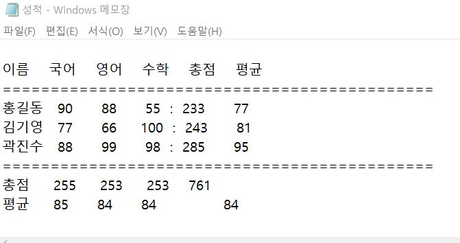

## practice 3 - 성적관리

```bash
이름   국어  영어  수학    총점  평균
==================================
홍길동  90   88    55   : ??    ??
김기영  77   66   100   : ??    ??
곽진수  88   99    98   : ??    ??
==================================
총점    ??   ??   ??      ??    ??
평균    ??   ??   ??      ??    ??
```

```bash
1. 자료구조 : dict형태로 data 저장
2. 개인에 대한 총점, 평균
3. 과목에 대한 총점, 평균
4. 전체 총점, 평균
5. file처리(성적.txt)
```

```python
data_h = {'국어' : 90, '영어' : 88, '수학' : 55} #홍길동 성적
data_k = {'국어' : 77, '영어' : 66, '수학' : 100} #김기영 성적
data_G = {'국어' : 88, '영어' : 99, '수학' : 98} #곽진수 성적

data_ko = {'홍길동' : 90, '김기영' : 77, '곽진수' : 88} #학생별 국어점수
data_en = {'홍길동' : 88, '김기영' : 66, '곽진수' : 99} #학생별 영어점수
data_ma = {'홍길동' : 55, '김기영' : 100, '곽진수' : 98} #학생별 수학점수

#학생별 국영수점수
data_all = {'홍길동ko' : 90, '김기영ko' : 77, '곽진수ko' : 88, '홍길동en' : 88, '김기영en' : 66, '곽진수en' : 99, '홍길동ma' : 55, '김기영ma' : 100, '곽진수ma' : 98}


class Calculate:
    def Total(self,a):
        T = list(a.keys())
        s = 0
        for x in range(len(a)):
            n = a.get(T[x])
            s = s + n
        return s

    def Average(self,a):
        T = list(a.keys())
        s = 0
        for x in range(len(a)):
            n = a.get(T[x])
            s = s + n
        return s / len(a)

Q = Calculate()

Q1 = Q.Total(data_h)
Q2 = Q.Average(data_h)
Q3 = Q.Total(data_k)
Q4 = Q.Average(data_k)
Q5 = Q.Total(data_G)
Q6 = Q.Average(data_G)
Q7 = Q.Total(data_ko)
Q8 = Q.Total(data_en)
Q9 = Q.Total(data_ma)
Q10 = Q.Total(data_all)
Q11 = Q.Average(data_ko)
Q12 = Q.Average(data_en)
Q13 = Q.Average(data_ma)
Q14 = Q.Average(data_all)
        
print("""
이름    국어    영어    수학    총점    평균
=============================================
홍길동   90      88      55  :  %d      %d
김기영   77      66     100  :  %d      %d
곽진수   88      99      98  :  %d      %d
=============================================
총점     %d     %d     %d    %d
평균     %d      %d      %d              %d """ %(Q1,Q2,Q3,Q4,Q5,Q6,Q7,Q8,Q9,Q10,Q11,Q12,Q13,Q14))

f = open("성적.txt",'w')
f.write("""
이름    국어    영어    수학    총점    평균
=============================================
홍길동   90      88      55  :  %d      %d
김기영   77      66     100  :  %d      %d
곽진수   88      99      98  :  %d      %d
=============================================
총점     %d     %d     %d    %d
평균     %d      %d      %d              %d """ %(Q1,Q2,Q3,Q4,Q5,Q6,Q7,Q8,Q9,Q10,Q11,Q12,Q13,Q14))

f.close()

```


+ 출력 결과

```bash
이름    국어    영어    수학    총점    평균
=============================================
홍길동   90      88      55  :  233      77
김기영   77      66     100  :  243      81
곽진수   88      99      98  :  285      95
=============================================
총점     255     253     253    761
평균     85      84      84              84 
```


