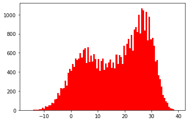

## practice 4 - 기온 공공데이터 분석

### 1. 기온 데이터 분석 시작하기

 1. 기온 공공데이터 가져오기

    + ([기상자료개방포털 ](https://data.kma.go.kr/cmmn/main.do))
    
 2. 서울의 기온 데이터 다운로드
    + 메뉴 - 기후통계분석 - 통계분석 - 기온분석 
    + 기간을 가장 옛날부터 가장 최근까지 설정 
    + 지역은 서울로 설정
    + 검색 버튼 누르기
    + CSV 버튼 누르기


​	3. 다운받은 CSV파일을 열고 아래에 보이는 데이터 삭제하고 'seoul.csv'로 저장 


### 2. 서울 기온 데이터 분석

**데이터 출력하기**

```python
import csv

f = open('seoul.csv', 'r', encoding='cp949')
data = csv.reader(f, delimiter=',')
for row in data:
    print(row)
f.close()
```

+ 출력결과

```bash
['날짜', '지점', '평균기온(℃)', '최저기온(℃)', '최고기온(℃)']
['1907-10-01', '108', '13.5', '7.9', '20.7']
['1907-10-02', '108', '16.2', '7.9', '22']
['1907-10-03', '108', '16.2', '13.1', '21.3']
['1907-10-04', '108', '16.5', '11.2', '22']
...
['2022-02-20', '108', '-4.8', '-8.4', '-0.5']
['2022-02-21', '108', '-3', '-8.1', '3.6']
['2022-02-22', '108', '-4.5', '-8', '0.5']
['2022-02-23', '108', '-5.6', '-10', '-0.6']
['2022-02-24', '108', '-2.4', '-8.5', '3.7']
```


**헤더 저장하기**

```python
import csv
f = open('seoul.csv')
data = csv.reader(f)
header = next(data)
for row in data:
    print(row)
f.close()
```

+ 출력결과

```bash
['1907-10-01', '108', '13.5', '7.9', '20.7']
['1907-10-02', '108', '16.2', '7.9', '22']
['1907-10-03', '108', '16.2', '13.1', '21.3']
['1907-10-04', '108', '16.5', '11.2', '22']
['1907-10-05', '108', '17.6', '10.9', '25.4']
['1907-10-06', '108', '13', '11.2', '21.3']
...
```


**서울의 가장 더웠던 날은 언제였을까?를 구해보기**

> 1.  최고 기온을 실수로 변환

```python
import csv
f = open('seoul.csv')
data = csv.reader(f)
header = next(data)
for row in data:
    row[-1] = float(row[-1]) # 최고 기온을 실수로 변환
    print(row)
f.close()
```

+ 출력결과

```bash
['1907-10-01', '108', '13.5', '7.9', 20.7]
['1907-10-02', '108', '16.2', '7.9', 22.0]
['1907-10-03', '108', '16.2', '13.1', 21.3]
['1907-10-04', '108', '16.5', '11.2', 22.0]
['1907-10-05', '108', '17.6', '10.9', 25.4]
...
['1950-08-28', '108', '21.2', '16.4', 28.4]
['1950-08-29', '108', '23.1', '16.8', 30.4]
['1950-08-30', '108', '24.6', '18', 32.6]
['1950-08-31', '108', '25.4', '20.1', 32.5]
---------------------------------------------------------------------------
ValueError                                Traceback (most recent call last)
~\AppData\Local\Temp/ipykernel_133812/3002585587.py in <module>
      4 header = next(data)
      5 for row in data:
----> 6     row[-1] = float(row[-1]) # 최고 기온을 실수로 변환
      7     print(row)
      8 f.close()

ValueError: could not convert string to float: ''

-> 누락된 기온 데이터가 있기 때문
```

```python
import csv
f = open('seoul.csv')
data = csv.reader(f)
header = next(data)
for row in data:
    if row[-1] == '':
        row[-1] = -999 # 최고 기온이 될 수 없는 값으로 빈 문자열이 있던 자리라고 표시
    row[-1] = float(row[-1])
    print(row)
f.close()
```

+ 출력결과

```bash
['1907-10-01', '108', '13.5', '7.9', 20.7]
['1907-10-02', '108', '16.2', '7.9', 22.0]
['1907-10-03', '108', '16.2', '13.1', 21.3]
['1907-10-04', '108', '16.5', '11.2', 22.0]
['1907-10-05', '108', '17.6', '10.9', 25.4]
...
['2022-02-22', '108', '-4.5', '-8', 0.5]
['2022-02-23', '108', '-5.6', '-10', -0.6]
['2022-02-24', '108', '-2.4', '-8.5', 3.7]
```


> 2.  서울의 최고 기온 값 구하기

```python
import csv
f = open('seoul.csv')
data = csv.reader(f)
header = next(data)
max_temp = -999 # 최고 기온을 저장할 변수 초기화
max_date = '' # 최고 기온이었던 날짜를 저장할 변수 초기화

for row in data:
    if row[-1] == '': # 만약 데이터가 누락되었다면 최고 기온을 -999로 저장
        row[-1] = -999 
    row[-1] = float(row[-1])
    if max_temp < row[-1]: 	# 만약 지금까지 최고 기온보다 더 높다면 업데이트
        max_date = row[0]
        max_temp = row[-1]
f.close()

print('기상 관측 아래 서울의 최고 기온이 가장 높았던 날은',max_date+'로',max_temp,'도 였습니다.')
```

+ 출력결과

```bash
기상 관측 아래 서울의 최고 기온이 가장 높았던 날은 2018-08-01로 39.6 도 였습니다.
```


**데이터 시각화 해보기**

```python
# 데이터 리스트에 저장하기
import csv
f = open('seoul.csv')
data = csv.reader(f)
next(data)
result = []

for row in data:
    if row[-1] != '':
        result.append(float(row[-1]))
print(result)
```

+ 출력결과

```bash
[20.7, 22.0, 21.3, 22.0, 25.4, 21.3, 16.1, 14.9, 21.1, 24.1, 20.4, 17.4, 21.3, 20.6, 20.9, 20.2, 21.6, 20.9, 21.3, 22.7, 19.9, 19.6, 16.3, 17.1, 18.7, 18.2, 20.7, 19.6, 20.0, 20.1, 20.3, 21.3, 21.1, 11.1, 13.6, 17.0, 18.1, ...]
```

```python
# 데이터 시각화
import matplotlib.pyplot as plt

plt.figure(figsize=(10,2))
plt.plot(result, 'r')
plt.show
```

+ 출력결과


>  특정 일의 기온 변화를 그래프로 그려보기

```python
# 2월 14일인 날들의 최고 기온 변화 시각화
import csv
f = open('seoul.csv')
data = csv.reader(f)
next(data)
result = []

for row in data:
    if row[-1] != '':
        if row[0].split('-')[1] == '02' and row[0].split('-')[2] == '14':
            result.append(float(row[-1]))
            
import matplotlib.pyplot as plt

plt.figure(figsize=(10,2))
plt.plot(result, 'pink')
plt.show
```

+ 출력결과


```python
# 2월 14일의 최고 기온 변화와 최저 기온 변화 시각화
import csv
f = open('seoul.csv')
data = csv.reader(f)
next(data)
high = []
low = []

for row in data:
    if row[-1] != '' and row[-2] != '':
        if row[0].split('-')[1] == '02' and row[0].split('-')[2] == '14':
            high.append(float(row[-1]))
            low.append(float(row[-2]))
            
import matplotlib.pyplot as plt

plt.figure(figsize=(10,2))
plt.plot(high, 'pink')
plt.plot(low, 'skyblue')
plt.show
```

+ 출력결과


> 데이터를 다양하게 시각화하기

```python
# 히스토그램으로 표현하기
import csv
import matplotlib.pyplot as plt

f = open('seoul.csv')
data = csv.reader(f)
next(data)
result = []

for row in data:
    if row[-1] != '':
        result.append(float(row[-1]))
        
plt.hist(result, bins=100, color='r')
plt.show()
```

+ 출력결과



```python
# 상자그림으로 표현하기
import csv
import matplotlib.pyplot as plt

f = open('seoul.csv')
data = csv.reader(f)
next(data)
result = []

for row in data:
    if row[-1] != '':
        result.append(float(row[-1]))
        
plt.boxplot(result)
plt.show()
```

+ 출력결과


```python
# 데이터를 월별로 분류해 상자그림으로 표현
import csv
import matplotlib.pyplot as plt

f = open('seoul.csv')
data = csv.reader(f)
next(data)
month = [[],[],[],[],[],[],[],[],[],[],[],[]]

for row in data:
    if row[-1] != '':
        month[int(row[0].split('-')[1])-1].append(float(row[-1]))
        
plt.boxplot(month)
plt.show()
```

+ 출력결과


